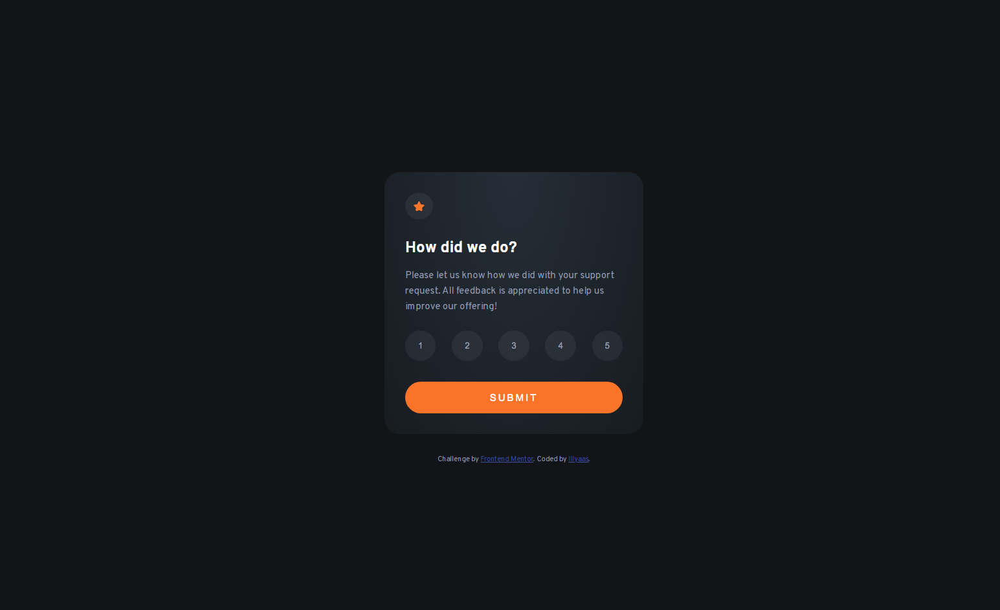

# Frontend Mentor - Interactive rating component solution

This is a solution to the [Interactive rating component challenge on Frontend Mentor](https://www.frontendmentor.io/challenges/interactive-rating-component-koxpeBUmI).

## Table of contents

- [Overview](#overview)
  - [The challenge](#the-challenge)
  - [Screenshot](#screenshot)
  - [Links](#links)
- [My process](#my-process)
  - [Built with](#built-with)
  - [What I learned](#what-i-learned)
  - [Continued development](#continued-development)
  - [Useful resources](#useful-resources)
- [Author](#author)

## Overview

### The challenge

Users should be able to:

- View the optimal layout for the app depending on their device's screen size
- See hover states for all interactive elements on the page
- Select and submit a number rating
- See the "Thank you" card state after submitting a rating

### Screenshot



### Links

- Solution URL: [Add solution URL here](https://github.com/Illyaas4Show/Interactive-rating-component)
- Live Site URL: [Add live site URL here](https://shimmering-crisp-40749e.netlify.app)

## My process

### Built with

- Semantic HTML5 markup
- CSS custom properties
- Flexbox
- JavaScript

### What I learned

This is my first ever JavaScript project and I am pretty happy with it. JavaScript is quite fun. I learnt some basic things about js like:

```js
element.style.background = ('red'); // To style things
document.querySelectorAll('element'); // And how selectors work

// If statements
if (condition) {
  output
} else {
  other output
}

// Also used arrow functions which I love!
let function = (param) => {
  function
}

```

### Continued development

I would really like to improve my javascript skills as it is very useful.

### Useful resources

- [W3Schools](https://www.w3schools.com/) - I always use this site to check on things. It is the most useful site I have ever used for coding!

## Author

- Frontend Mentor - [@Illyaas4Show](https://www.frontendmentor.io/profile/Illyaas4Show)
